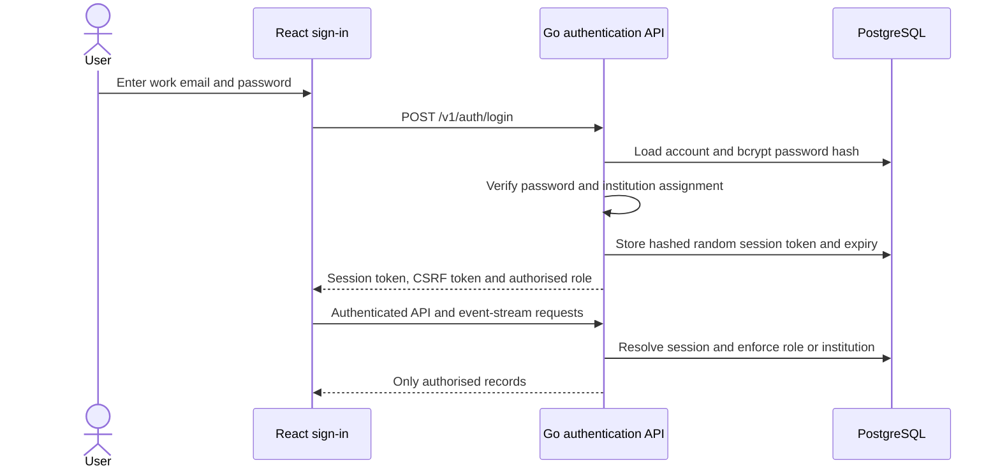
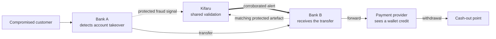
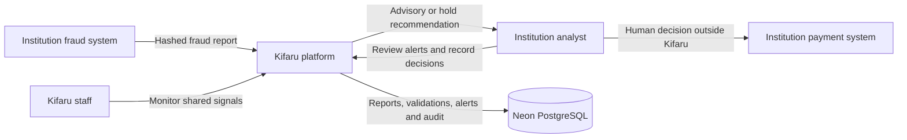
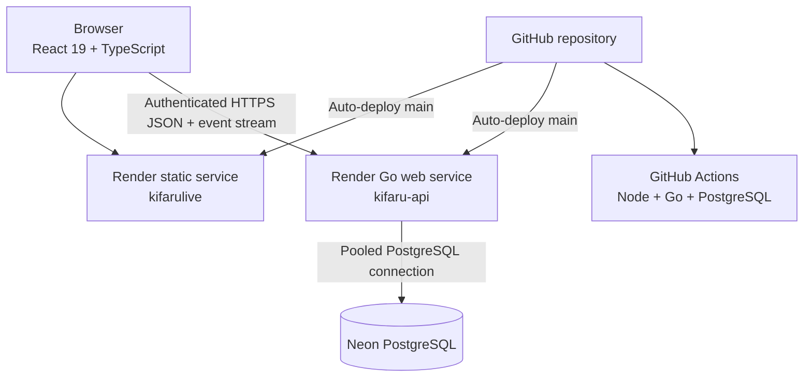
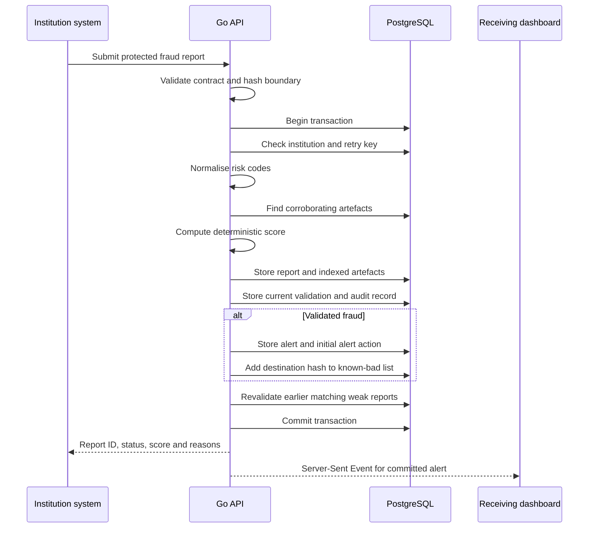
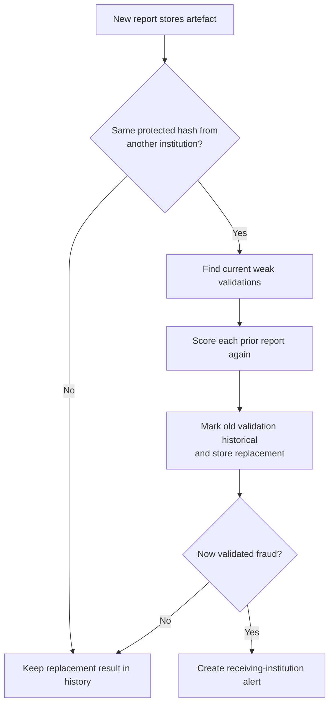
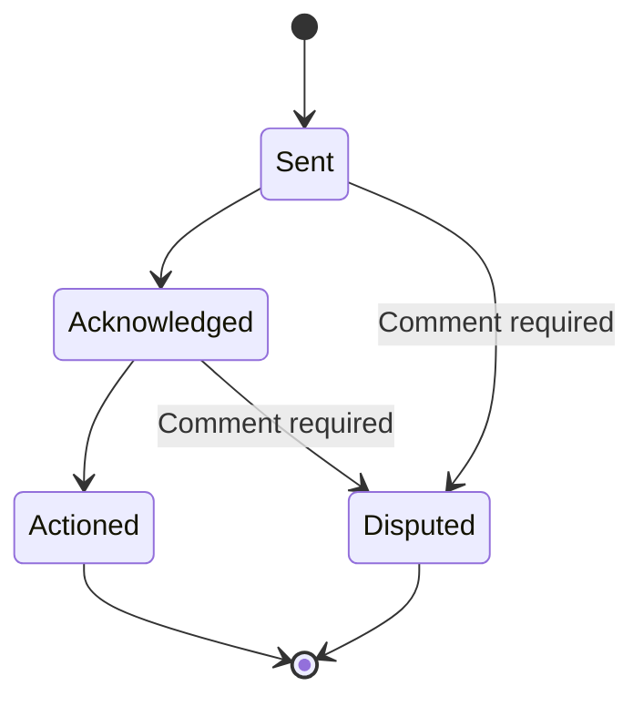
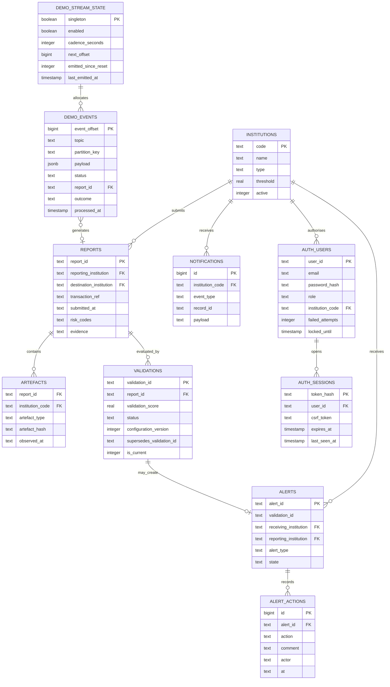
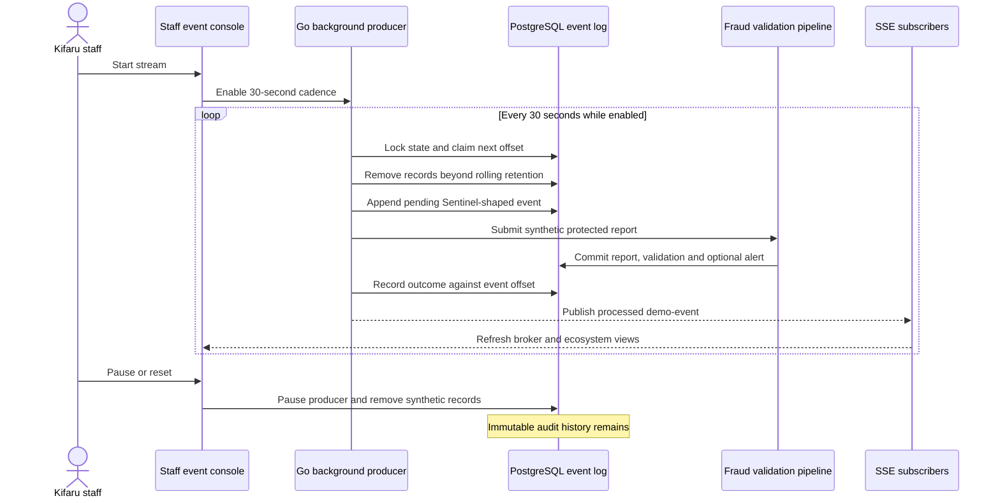

# Kifaru

Kifaru is a shared fraud-validation platform for Kenyan financial institutions.
It receives fraud signals that banks, SACCOs and payment providers have already
detected, checks them against a common risk standard, looks for corroboration
from other institutions and alerts the institution that can still stop the
money.

Kifaru does not replace an institution's fraud system and does not block
payments. It gives the receiving institution timely, explainable evidence so
its own staff can decide what to do.

**Live application:** https://kifarulive.onrender.com

**Kifaru staff route:** https://kifarulive.onrender.com/staff

**API health:** https://kifaru-api.onrender.com/health

## Project status

The application is a deployed school-project prototype built with synthetic
data. The core validation flow, PostgreSQL persistence, institution dashboards,
cross-institution matching, automatic revalidation, alert lifecycle and
continuous integration are implemented.

Demo sign-in is enforced by the Go API. Passwords are verified with bcrypt,
sessions are stored in PostgreSQL, and every protected route checks the user's
role and assigned institution. This is real authentication for the pitch
environment, but it is not a replacement for a production identity provider,
MFA or bank-managed access governance.

### Starting code

The first two commits, `fa432c5` ("starting") and `81aeba3` ("separated the
dashboards"), were pushed by GitHub user `bsylvia24-png` on 29 and 30 September
2026. They add the starting prototype: a FastAPI backend, the synthetic
datasets and scripts, and the first React dashboard. Every later commit is by
`tmjoris`, beginning with the move of the backend to Go and Neon PostgreSQL.

## What the system does

1. An institution submits a suspected fraud report through REST, webhook,
   SOC-style connector, batch JSON or CSV.
2. Kifaru rejects clear identifiers and reports that contain no recognised
   risk code.
3. Institution rule IDs and behavioural evidence are mapped to the central
   Kifaru fraud standard.
4. A deterministic validator scores the report using risk severity,
   corroboration, knowledge-base matches and the institution's threshold.
5. The report receives one outcome:
   `VALIDATED_FRAUD`, `INSUFFICIENT_EVIDENCE` or `NOT_FRAUD`.
6. Only validated fraud produces an alert for the destination institution.
7. A new matching report automatically causes earlier weak reports to be
   evaluated again.
8. Connected dashboards receive new alerts through Server-Sent Events.
9. Analysts can acknowledge, action or dispute alerts. A dispute requires a
   comment and creates a notification for the reporting institution.

## Users and workspaces

### Institution staff

Institution staff sign in at `/`. A bank is not permanently classified as a
"reporting bank" or a "receiving bank". Those are roles in a particular report.
Every institution workspace therefore contains:

- Flags submitted
- Alerts received
- Related history
- Reports and risk-code analysis
- Knowledge-base information
- Institution governance and threshold settings

The ecosystem includes every licensed bank in Kenya: the 37 commercial banks
and HFC, the one mortgage finance institution. The list comes from the
Kenya Deposit Insurance Corporation's member institutions (membership is
compulsory for every licensed bank), cross-checked against the Central Bank of
Kenya's July 2026 directory, and lives in `backend/data/kenyan_banks.json`.
The API and the dashboard both read that one file. The directory also includes
Kenya's two largest mobile money providers, M-Pesa (Safaricom PLC) and Airtel
Money (Airtel Money Kenya Limited), where stolen funds are often cashed out.

The names are real. Every report, alert, connector detail and event shown
for them is synthetic, generated by Kifaru for the demonstration. No institution
has supplied, reviewed or endorsed any of it, and the sign-in screen and every
workspace header say so.

The authenticated institution selector covers all 38 licensed banks, M-Pesa and
Airtel Money. Every directory participant has a working named demonstration
account listed in the local ignored `demo-credentials.txt`; the identities are
synthetic and include a broader set of Kenyan names.
Dense transaction tables prioritise decision fields on briefing-sized desktop
screens and switch to labelled record cards on mobile. Full provenance and
customer-reference details remain available in each investigation drawer.

### Kifaru staff

Kifaru staff use `/staff`. This route does not ask for an institution. It opens
the ecosystem view of shared fingerprints, cross-institution matches and
participating institutions.

## Demo authentication

The browser never decides which institution a person may view. A successful
login creates an opaque random session token, stores only its SHA-256 digest in
PostgreSQL and binds it to a user with either an institution or staff role.



Authentication controls include:

- Bcrypt password verification; plaintext passwords are never stored in the
  repository or database
- Five-minute account lockout after five failed password attempts
- Eight-hour browser sessions, or seven days when **Keep me signed in** is used
- Opaque bearer sessions whose stored database value is a one-way digest
- CSRF tokens on state-changing browser requests
- Institution users restricted to their assigned institution
- Alert actions restricted to the receiving institution
- Staff-only access to global statistics, audit history, knowledge-base writes,
  manual revalidation and synthetic-stream controls
- Authenticated live-event streaming with automatic reconnection
- Login and logout entries in the append-only audit history

The 40 institution accounts and the Kifaru staff account all use the same local
demonstration password. Their complete details are kept in
`demo-credentials.txt`, which is deliberately ignored by Git. Do not reuse those
credentials for any real service. Generated addresses use clean institution
domains such as `lucynaserian@airtel.co.ke`; names are concatenated without `.`,
`+` or `-` separators. These remain synthetic demonstration identities.

## The visibility gap Kifaru closes

One institution can identify a compromised customer while every downstream
participant sees only a normal-looking transfer. Kifaru connects those partial
views without moving raw customer identifiers outside each institution.



The transaction still moves through institution-owned systems. Kifaru adds the
shared evidence needed for the receiving institution to recognise the wider
campaign and decide whether to hold or investigate the funds.

## System context



Customer names, raw account numbers, raw phone numbers and hashing secrets stay
inside the participating institution. Kifaru receives protected identifiers,
amounts, institution codes, rule IDs and supporting evidence.

## Deployed architecture

The original design proposed FastAPI. The implementation uses Go instead. The
framework changed, but the important design properties remain: one stateless API,
one PostgreSQL database, deterministic scoring and a React dashboard.



The frontend and API are deployed separately. `VITE_API_URL` supplies the API
hostname during the frontend build. Render provides HTTPS for both services.

## Backend processing pipeline

The core write path runs inside one PostgreSQL transaction. A report,
validation, alert, artefacts, knowledge-base update and audit records either
commit together or roll back together.



### Retry safety

`(reporting_institution, transaction_ref)` is unique. Repeating a submission
returns the original report rather than inserting a duplicate. The first
pipeline migration removes duplicate replay data before installing this
constraint.

### Automatic revalidation

Artefacts are indexed by protected hash and observation time. Matching is
limited to reports from other institutions within the 30-day prototype window.



Every replacement validation points to the validation it supersedes. Only one
validation per report is marked current.

## Validation model

Scoring is deterministic and implemented with named constants in the Go API:

| Input | Weight |
|---|---:|
| Risk-code severity | `severity × 0.50` |
| Each corroborating institution | `+0.18`, capped at three |
| Known-bad match | `+0.30` |
| Known-good match | `-0.55` |
| Institution score above its threshold | `+0.10` |

The resulting score is clamped to `0.00–0.99`.

| Score | Outcome |
|---|---|
| `>= 0.60` | `VALIDATED_FRAUD` |
| `>= 0.35` and `< 0.60` | `INSUFFICIENT_EVIDENCE` |
| `< 0.35` | `NOT_FRAUD` |

The validation stores the reason codes, corroborating institutions, agent
version, decision time, configuration version and plain-language explanation.
The explanation describes the decision but never changes the score.

### Device and network changes

Fraudsters often change phones, SIM cards or networks to avoid detection.
Kifaru picks this up in two ways:

- **Within one institution.** The normaliser turns the institution's device and
  network evidence into risk codes: `ip_country_changed` or `vpn_proxy_tor`
  adds `IP-404` (access from a foreign or anonymising network), and
  `is_emulator` or `is_rooted` adds `IP-403`. Institution rules such as
  `NET_FOREIGN_ASN` and `DEV_UNRECOGNISED_DEVICE` map to the same codes.
- **Across institutions.** A fraudster can use a new device at each
  institution, but the stolen money still has to reach the same cash-out
  account. Corroboration matches on that protected destination, so the reports
  still link up. When another institution reported the same destination from a
  different device fingerprint, the validation adds the reason code
  `LINK:device_switch` and the explanation says so.

`LINK:device_switch` explains a decision and carries no weight, so the scoring
table above is unchanged.

## Alert lifecycle

Alerts carrying a transferable amount request a hold. Events with no
transferable amount are marked advisory.



Every transition creates an `alert_actions` row and an audit event. A dispute
also creates a notification addressed to the reporting institution.

## Data model



## Database migrations and audit integrity

SQL migrations live in `backend/migrations/` and are embedded into the Go
binary. Applied filenames are recorded in `schema_migrations`, so each migration
runs once.

The first migration:

- Removes duplicate replay submissions while retaining one original report
- Adds retry-safe report uniqueness
- Creates and backfills the artefact index
- Adds validation replacement and configuration-version fields
- Adds advisory alert classification
- Adds alert actions and institution notifications
- Extends audit records with old value, new value and reason
- Installs a PostgreSQL trigger that rejects audit-row updates and deletes

The second migration creates the synthetic SOC event broker:

- One durable producer-state row with pause/resume and a 30-second cadence
- An ordered `sentinel.security-alert` event log with monotonic offsets
- Processing status, report IDs, outcomes and failure details for every event
- Rolling retention of the latest 500 processed events and their generated data

The third migration renamed the demo institutions for a time. Names now come
from `backend/data/kenyan_banks.json` and are refreshed every time the API
starts, while any threshold an administrator has set is kept.

The fourth migration adds demo users and expiring sessions. The fifth replaces
the old 500-event stop with rolling retention and resumes deployments that had
paused only because they reached that former ceiling. The producer also repairs
that exact legacy state if a retiring instance reaches the ceiling during a
rolling deployment.

Audit entries are written for validations, automatic and manual revalidation,
alert decisions, configuration updates, threshold changes and knowledge-base
changes.

## Synthetic Microsoft Sentinel event stream

Kifaru staff can run a continuous synthetic SOC feed from the `/staff`
workspace. It behaves like a small Kafka topic while remaining deployable on the
project's existing Render and PostgreSQL services:

- Topic: `sentinel.security-alert`
- Default cadence: one event every 30 seconds
- Durable, increasing offsets
- Pause, resume, emit-one and reset controls
- Rolling retention of the latest 500 processing results
- Server-Sent Event notification after processing
- Continuous production without an event-count stop

The payloads follow public Microsoft Sentinel `SecurityAlert` conventions,
including `SystemAlertId`, `AlertName`, `AlertSeverity`, `ProviderName`,
`CompromisedEntity`, `Entities`, `Tactics`, `Techniques` and
`ExtendedProperties`. Transaction amounts and behavior are synthetic and
informed by the public PaySim mobile-money simulator. No private SOC logs or
customer transactions are copied into the repository.

The producer rotates through paired cross-institution scenarios:

- SIM change followed by a new-device transfer
- New mule account receiving and rapidly forwarding funds
- New beneficiary followed by a high-value transfer
- Credential reset from an unfamiliar device on a foreign network, with no
  money moved yet
- An unusual but potentially legitimate payment requiring corroboration
- A fraudster who uses a different device and network at each institution
  before paying a fresh beneficiary

Two consecutive events in a campaign share one protected destination artefact
but originate from different institutions. Each campaign draws its two
reporting institutions and its receiving institution from the full list,
stepping through it so that every bank and mobile money provider reports,
corroborates and receives alerts in turn.
The first report of a campaign
usually remains `INSUFFICIENT_EVIDENCE`; the matching report from another
institution upgrades it to `VALIDATED_FRAUD`. This exercises Kifaru's automatic
corroboration and revalidation path rather than merely changing dashboard
counters. The credential-reset campaign ends in an advisory alert, because no
money has moved. The device-switch campaign ends in a hold alert that carries
`LINK:device_switch`. The legitimate-payment campaign never reaches an alert.



Rolling retention and manual reset remove the affected stream reports,
validations, alerts, indexed artefacts, knowledge-base additions and broker
events. Append-only audit records remain.

Public references used for the synthetic schema and scenarios:

- [Microsoft Sentinel security alert schema](https://learn.microsoft.com/en-us/azure/sentinel/security-alert-schema)
- [SecurityIncident table reference](https://learn.microsoft.com/en-us/azure/azure-monitor/reference/tables/securityincident)
- [CommonSecurityLog table reference](https://learn.microsoft.com/en-us/azure/azure-monitor/reference/tables/commonsecuritylog)
- [Microsoft Sentinel public sample data](https://github.com/Azure/Azure-Sentinel/tree/master/Sample%20Data)
- [PaySim mobile-money simulator](https://github.com/EdgarLopezPhD/PaySim)

## Real-time delivery

`GET /v1/stream?institution=...` opens a Server-Sent Events connection.
Institution workspaces subscribe to their own code; the Kifaru staff workspace
subscribes to the ecosystem stream. The browser reconnects automatically if the
connection drops, and committed alert events trigger a dashboard refresh.

Streams are held in memory because the prototype runs one API instance. A
multi-instance deployment would need PostgreSQL `LISTEN/NOTIFY` or another
shared delivery mechanism.

## Main API routes

```text
POST   /v1/reports
POST   /v1/reports/batch
POST   /v1/reports/csv
POST   /validate-csv
POST   /v1/hooks/{source}

GET    /v1/history?institution=
GET    /v1/reports?institution=
GET    /v1/alerts?institution=
GET    /v1/validations/{report_id}
GET    /v1/stream?institution=
POST   /v1/alerts/{alert_id}/state

POST   /v1/auth/login
GET    /v1/auth/session
POST   /v1/auth/logout

GET    /v1/institutions
GET    /v1/standard
GET    /v1/stats

GET    /v1/admin/config
PATCH  /v1/admin/config
GET    /v1/admin/kb
POST   /v1/admin/kb
DELETE /v1/admin/kb
POST   /v1/admin/revalidate
GET    /v1/admin/audit
GET    /v1/admin/demo-stream
POST   /v1/admin/demo-stream/state
POST   /v1/admin/demo-stream/emit
POST   /v1/admin/demo-stream/reset
```

## Requirements coverage

The implementation is based on:

- `Kifaru Requirements Specification`, Part I, 25 September 2026
- `Kifaru System Design and Planning`, Part II, 26 September 2026

### Implemented

- Server-verified demo authentication with bcrypt passwords
- PostgreSQL-backed expiring sessions and account lockout
- Staff and institution roles with server-side institution boundaries
- Receiving-institution authorization for alert actions
- CSRF protection and authenticated event streaming
- Four ingestion paths
- Contract validation and protected-identifier gate
- Unique report IDs and recorded submission channel/time
- Central risk-code mapping and behavioural derivation
- Rejection when no risk code can be produced
- Deterministic three-outcome validation
- Stored reasons, corroboration, agent version and timing
- Automatic revalidation after cross-institution corroboration
- Template explanations independent of the score
- Destination-only routing for validated fraud
- No alerts for weak or rejected outcomes
- Real-time dashboard alert events
- Advisory alerts for zero-amount events
- Device and network change signals, and a cross-institution device-switch flag
- Browser-side hashing of identifier columns in CSV uploads
- All 38 licensed Kenyan banks and the two largest mobile money providers, each
  with synthetic activity from the stream
- Acknowledge, action and dispute lifecycle
- Mandatory dispute comments and reporting-institution notifications
- Unified institution views for received alerts, submitted flags and history
- Search and outcome filtering
- Ecosystem-wide Kifaru staff view
- Global and per-institution threshold configuration
- Ingestion-source configuration
- Known-good and known-bad knowledge base
- Automatic known-bad addition after validated fraud
- Manual revalidation
- Expanded append-only audit history
- Durable Microsoft Sentinel-shaped synthetic event stream
- Ordered event offsets, processing outcomes, pause/resume and reset controls
- No payment blocking or reversal API

### Prototype limitations

- Accounts are seeded pitch identities, not accounts provisioned by a bank
  identity provider.
- MFA, password recovery, identity lifecycle management and external service
  credentials are not implemented.
- Browser bearer-token storage is suitable for this controlled synthetic-data
  demo, but a production deployment should use bank-managed SSO and stronger
  browser isolation.
- Synthetic identifiers use the historical prototype formats; the API rejects
  missing hash prefixes but does not yet require a full 64-character digest for
  every legacy evidence field.
- SSE delivery is designed for one API instance.
- The demo broker uses PostgreSQL rather than an external Kafka cluster. It
  preserves the ordering, offset, retention and consumer-facing behavior needed
  for this prototype without adding another hosted service.
- All continuous-stream records are synthetic. Public Sentinel schemas and
  PaySim patterns inform their shape; they are not real bank SOC events.
- The API does not yet publish an OpenAPI document.
- Accuracy and latency figures still need a final measured report from the
  complete synthetic replay.
- The frontend and API are separate Render services rather than one origin.

## Repository layout

```text
.
├── .github/workflows/ci.yml      # Frontend and PostgreSQL-backed backend CI
├── backend/
│   ├── data/                     # Fraud standard and synthetic datasets
│   ├── migrations/               # Ordered PostgreSQL migrations
│   ├── auth.go                   # Password, session and authorization controls
│   ├── database.go               # PostgreSQL startup and migrations
│   ├── router.go                 # HTTP routing and CORS
│   ├── pipeline.go               # Fraud validation transaction
│   ├── handlers.go               # Dashboard and administration handlers
│   ├── events.go                 # SSE and synthetic Sentinel broker
│   ├── csv_ingest.go             # CSV ingestion adapter
│   ├── support.go                # Shared persistence and parsing helpers
│   ├── models.go                 # Shared Go models and constants
│   ├── main.go                   # Process startup
│   ├── main_test.go              # Unit and PostgreSQL integration tests
│   └── schema.sql                # Baseline PostgreSQL schema
├── public/                       # Static frontend assets
├── src/                          # React application and API client
├── render.yaml                   # Render API and frontend services
└── README.md                     # Project and architecture documentation
```

## Local development

### Requirements

- Node.js 22.18 or later
- Go 1.22 or later
- PostgreSQL, or a Neon PostgreSQL connection string

### Start the API

```bash
export DATABASE_URL='postgresql://...'
npm run server
```

The API listens on `http://127.0.0.1:8000` unless `PORT` is set.

### Start the frontend

```bash
npm install
npm run dev
```

Open `http://127.0.0.1:5173`. Vite proxies `/api` to the local Go API.
The Kifaru staff route is `http://127.0.0.1:5173/staff`.
Use the accounts in the local, git-ignored `demo-credentials.txt`.

## Tests

Run the local checks:

```bash
npm run build
npm test
cd backend
go test ./...
```

Set `TEST_DATABASE_URL` to run the PostgreSQL integration test locally:

```bash
export TEST_DATABASE_URL='postgresql://.../kifaru_test'
go test ./...
```

The backend tests cover:

- Password verification and seeded demo accounts
- Unauthenticated request rejection
- Institution mismatch and cross-tenant access rejection
- Staff-only administration and authenticated logout
- Clear identifier rejection
- Cleartext identifier rejection in CSV uploads
- Behavioural risk-code derivation
- Device and network risk-code derivation
- Advisory versus hold alert classification
- Atomic PostgreSQL processing
- Automatic revalidation after corroboration
- Current and superseded validation records
- Retry idempotency
- Mandatory dispute comments
- Reporting-institution notification creation
- Rollback when persistence fails
- Audit-record creation
- Sentinel-shaped synthetic event generation
- Cross-institution campaign pairing
- Durable event retention and report processing
- Stream reset cleanup
- An advisory alert from the credential-reset campaign
- A validated device-switch campaign flagged with `LINK:device_switch`
- A complete institution list: 37 commercial banks, 1 mortgage finance
  institution and 2 mobile money providers
- Demo campaigns that reach every institution as reporter and receiver

The frontend tests also check that CSV identifier columns are hashed in the
browser, that the CSV parser keeps quoted fields intact, and that the dashboard
lists all 40 institutions once each.

GitHub Actions starts PostgreSQL 16, builds and tests the frontend, and runs the
Go test suite on every push to `main` and every pull request.

## Deployment

`render.yaml` defines:

- `kifaru-api`: Go web service
- `kifarulive`: Vite static frontend

The API requires `DATABASE_URL` and an exact `FRONTEND_ORIGIN`. The frontend
receives `VITE_API_URL` from the API service. Render deploys both services
automatically after commits reach `main`.

The static build also writes `dist/staff/index.html`, ensuring `/staff` works
even if a host does not apply single-page-application rewrites.

## Privacy and operating boundaries

- Raw customer identifiers must not be submitted.
- CSV uploads from the dashboard hash the identifier columns (`customer_ref`,
  `customer`, `customer_name`, `account_number`, `destination_account`,
  `destination_msisdn`, `msisdn`, `phone_number`) in the browser with
  HMAC-SHA256 before sending. The API refuses any row whose identifier columns
  still hold cleartext. The demo hashing key is public so that uploads from
  different browsers can match; a real institution would keep its own key, set
  through `VITE_UPLOAD_HASH_KEY`.
- Kifaru stores protected artefacts and institution routing data.
- Request bodies are not written to application logs.
- Kifaru validates and alerts; it never executes a payment hold.
- The pitch environment has password sessions and server-side tenant
  authorization. Production still requires bank-managed SSO and MFA, account
  provisioning and recovery, service credentials for institution connectors,
  a hashing-key agreement and a data protection impact assessment.
- The current data is synthetic and must not be treated as evidence of
  production accuracy. The institution names are real, but no institution has
  supplied or reviewed any record, and nothing shown describes a real
  institution's customers, systems or fraud cases.
