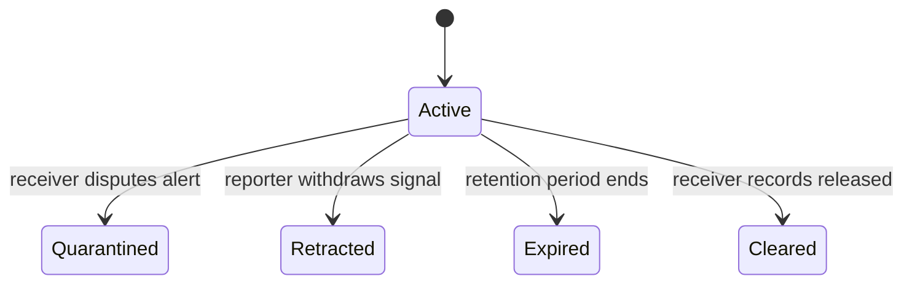
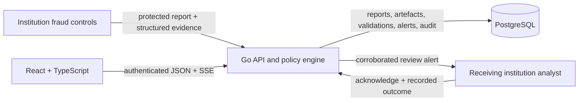

# Kifaru

Kifaru is a synthetic concept demonstration of a protected risk-signal exchange
for Kenyan financial institutions. Its primary job is to show how two
institutions could report the same beneficiary or mule-risk indicator, how that
independent match could be routed to the institution receiving the funds, and
how the receiver could record its own decision.

Kifaru does not identify a human fraudster, confirm fraud, block a payment, or
replace an institution's fraud system. It links protected artefacts and preserves
institution decision authority.

**Live application:** https://kifarulive.onrender.com

**Kifaru staff route:** https://kifarulive.onrender.com/staff

**API health:** https://kifaru-api.onrender.com/health

All reports, alerts, connector states, outcomes, and metrics shown in the
application are synthetic. Institution names are used for demonstration only;
no named institution has supplied, reviewed, participated in, or endorsed the
records shown.

## Demonstrated objective

The focused use case is cross-institution beneficiary and mule-risk
intelligence:

1. An institution's existing controls detect suspicious activity.
2. The institution submits structured evidence and protected identifiers.
3. Kifaru validates the evidence contract and applies a deterministic policy.
4. A signal remains active but does not alert a receiver until it has a
   qualified match from another institution.
5. When the policy and corroboration requirements are met, Kifaru routes a
   review alert to the destination institution.
6. The receiving institution acknowledges the alert and records `held`,
   `released`, or `recovered` as its own outcome.
7. Retraction, dispute, release, or expiry removes a signal from active
   corroboration and recalculates linked intelligence.

The interface makes this route visible:

```text
reporting institution
        \
         protected beneficiary indicator --> receiving institution --> recorded outcome
        /
corroborating institution
```

The relationship map links submitted artefacts, not people. A matching account,
mobile-money number, or device fingerprint can support an investigation, but it
does not establish that the same human controlled every event.

## Product surfaces

### Institution workspace

Institution staff sign in at `/`. The API binds every session to one
institution and limits the workspace to related records.

The workspace provides:

- Signals submitted by the institution
- Corroborated alerts received by the institution
- Related signal history
- Policy score and evidence explanations
- Receiving-institution outcomes
- Reporter-controlled signal retraction
- Notifications when shared intelligence changes
- Risk-code reports and masked knowledge-base entries
- Institution threshold controls
- Alias-only user admission requests

### Kifaru staff workspace

Kifaru staff sign in at `/staff`. The staff view provides:

- Ecosystem-wide synthetic signal history
- The protected-indicator relationship map
- A deterministic guided campaign
- The continuous Sentinel-shaped synthetic stream
- Honest operational counts and policy latency
- Institution user-admission decisions
- Stream and guided-scenario reset controls

The directory represents 37 commercial banks, HFC as the mortgage finance
institution, M-Pesa, and Airtel Money. Representation in the directory does not
mean operational participation.

## Guided campaign

The guided campaign is a deterministic NCBA → KCB → Equity Bank scenario built
for a reliable presentation flow:

1. **First report:** NCBA publishes a synthetic protected beneficiary signal.
   It remains `AWAITING_CORROBORATION`.
2. **Independent match:** KCB reports the same destination token, scoped to the
   same receiving institution. Both reports are recalculated and meet policy.
3. **Alert delivery:** Kifaru routes a `review` alert to Equity Bank.
4. **Receiver outcome:** the receiver acknowledges the alert and records a
   synthetic review hold.

Reset removes the guided reports, validations, alerts, actions, notifications,
and artefacts while leaving immutable audit history intact.

## Signal outcomes

Kifaru uses explicit signal and lifecycle states:

| Backend state | Interface label | Meaning |
|---|---|---|
| `CORROBORATED_SIGNAL` | Corroborated signal | Meets policy and has an eligible independent institution match |
| `AWAITING_CORROBORATION` | Awaiting corroboration | Active evidence exists, but no qualifying match or alert threshold has been reached |
| `BELOW_ALERT_THRESHOLD` | Below alert policy | Retained without a receiving-institution alert |
| `QUARANTINED` | Quarantined | A receiving institution disputed the source alert |
| `RETRACTED` | Retracted | The reporting institution withdrew the signal |
| `EXPIRED` | Expired | The active retention period ended |
| `CLEARED` | Cleared after review | The receiver released the activity after review |

Only `CORROBORATED_SIGNAL` creates a new receiver alert. Inactive lifecycle
states cannot support another report.

## Qualified corroboration

A match contributes to corroboration only when all of these conditions hold:

- It was reported by a different institution.
- The prior report is active and unexpired.
- The prior report's current state is awaiting or corroborated.
- Artefact type, protected hash, and match scope agree.
- The prior report falls within the configured matching window.

Destination-account and destination-MSISDN hashes are scoped to the receiving
institution. The same account-number string at two different banks therefore
does not match. Device fingerprints are treated as ecosystem-wide protected
artefacts in this demonstration.

One reporting institution contributes at most once to a report's corroboration
count. The demonstration verifies institutional separation; it does not prove
that two institutions relied on independent vendors, telemetry, or underlying
data sources.

## Evidence contract and policy

The Go API rejects:

- Unknown risk codes or bank rule IDs
- Risk codes without their required evidence fields
- Clear customer, account, mobile-number, or device identifiers
- Protected identifiers that are not `sha256:` plus 64 lowercase hexadecimal
  characters
- Unknown destination institutions
- Invalid timestamps, amounts, scores, or thresholds
- Narratives longer than 500 characters
- Narratives that appear to contain an email, Kenyan phone number, or long
  account-like number

The reporting threshold is loaded from server-side institution configuration;
the submitted value is not trusted.

Scoring is deterministic:

| Input | Weight |
|---|---:|
| Risk-code severity | `severity × 0.50` |
| Each eligible corroborating institution | `+0.18`, capped at three |
| Manually managed known-risk match | `+0.30` |
| Manually managed known-good match | `-0.55` |
| Institution score above its configured threshold | `+0.10` |

The score is clamped to `0.00–0.99`. A report is corroborated only when its
score reaches `0.60` **and** at least one eligible institution match exists.
Strong single-source evidence remains awaiting corroboration. Reports at
`0.35–0.59` remain awaiting; lower scores remain below alert policy.

Kifaru never automatically promotes a corroborated destination to the
known-risk list. Knowledge-base entries remain deliberate administrative
decisions.

## Reversible lifecycle

Signals are not permanent accusations.



When a signal becomes inactive, Kifaru:

1. Writes a new current validation while retaining the previous record.
2. Removes the signal from active corroboration.
3. Rescores linked reports.
4. Retracts linked alerts that no longer qualify.
5. Notifies affected reporting and receiving institutions.
6. Appends the change to immutable audit history.

Alert states are `sent`, `acknowledged`, `actioned`, `disputed`, and
`retracted`. An `actioned` alert must include one receiver outcome:

- `held`
- `released`
- `recovered`

These are recorded institution responses, not actions executed by Kifaru.

## Authentication and user admission

Authentication is enforced by the Go API:

- Bcrypt password verification
- Opaque random session tokens; only their SHA-256 digests are stored
- Eight-hour sessions, or seven days with **Keep me signed in**
- Five-minute lockout after five failed attempts
- CSRF validation on browser mutations
- Server-side staff and institution roles
- Institution-scoped history, alerts, notifications, and configuration
- Receiver-only alert decisions
- Reporter-only retraction, with staff expiry authority
- Authenticated Server-Sent Events

Every represented institution has six synthetic demonstration accounts: one
institution-specific identity and five reusable identities. Their addresses and
password are stored in the local, Git-ignored `demo-credentials.txt`. Those
credentials must never be reused for a real service.

An institution user can request another account by entering only an alias. The
API derives the email domain from the authenticated institution. Kifaru staff
approve or reject requests; approved accounts remain bound to the requesting
institution.

## Protected identifiers

CSV uploads hash supported identifier columns in the browser before upload:

- Customer reference or name
- Account number
- Destination account
- Destination MSISDN or phone number
- Device profile

The API independently rejects cleartext identifiers. Institution-facing
knowledge-base responses are masked, and a receiving institution does not
receive the reporting customer's protected hash in history responses.

The browser demonstration uses a shared public HMAC key so synthetic uploads
from separate browsers can match. That is not a production privacy design. A
real network would require governed tokenisation or privacy-enhancing
technology, institution-held secrets or an HSM-backed service, key rotation,
purpose limitation, retention enforcement, and a legal basis for processing.

## Synthetic event stream and metrics

Staff can run a continuous Microsoft Sentinel-shaped event stream:

- Topic: `sentinel.security-alert`
- One event every 30 seconds by default
- Durable monotonic offsets
- Pause, resume, emit-one, and reset controls
- Rolling retention of the latest 500 processing records
- Paired reports from different institutions
- Server-Sent Event refresh after committed processing

Scenarios cover SIM swap, account takeover, mule flow-through, beneficiary
change, credential reset, legitimate anomaly, and device/network switching.
The events use public Sentinel schema conventions and PaySim-informed synthetic
transaction patterns.

Displayed metrics are operational observations from current synthetic records:

- Signals
- Corroborated
- Awaiting
- Below policy
- Quarantined
- Alerts delivered
- Acknowledged
- Receiver-actioned
- Disputed
- Retracted
- Actioned synthetic value
- p95 policy latency

They do not claim production detection accuracy, fraud prevented, losses
avoided, participating institutions, or measured real-world effectiveness.

Public references:

- [Microsoft Sentinel security alert schema](https://learn.microsoft.com/en-us/azure/sentinel/security-alert-schema)
- [SecurityIncident table reference](https://learn.microsoft.com/en-us/azure/azure-monitor/reference/tables/securityincident)
- [CommonSecurityLog table reference](https://learn.microsoft.com/en-us/azure/azure-monitor/reference/tables/commonsecuritylog)
- [Microsoft Sentinel sample data](https://github.com/Azure/Azure-Sentinel/tree/master/Sample%20Data)
- [PaySim mobile-money simulator](https://github.com/EdgarLopezPhD/PaySim)

## Architecture



The frontend and API deploy separately on Render. PostgreSQL stores reports,
scoped artefacts, versioned validations, alerts, outcomes, notifications,
authentication, admission requests, guided state, event-stream state, and
append-only audit records.

The main write path is transactional. Report, artefacts, validation, optional
alert, revalidation, and audit records either commit together or roll back.
`(reporting_institution, transaction_ref)` provides idempotent retries.

## Main API routes

```text
POST   /v1/reports
POST   /v1/reports/batch
POST   /v1/reports/csv
POST   /validate-csv
POST   /v1/hooks/{source}

GET    /v1/history?institution=
GET    /v1/reports?institution=
GET    /v1/alerts?institution=
GET    /v1/validations/{report_id}
GET    /v1/notifications?institution=
GET    /v1/stream?institution=
POST   /v1/alerts/{alert_id}/state
PATCH  /v1/reports/{report_id}/lifecycle

POST   /v1/auth/login
GET    /v1/auth/session
POST   /v1/auth/logout
GET    /v1/user-requests
POST   /v1/user-requests

GET    /v1/institutions
GET    /v1/standard
GET    /v1/stats

GET    /v1/admin/config
PATCH  /v1/admin/config
GET    /v1/admin/kb
POST   /v1/admin/kb
DELETE /v1/admin/kb
POST   /v1/admin/revalidate
GET    /v1/admin/audit
PATCH  /v1/admin/user-requests/{request_id}

GET    /v1/admin/demo-stream
POST   /v1/admin/demo-stream/state
POST   /v1/admin/demo-stream/emit
POST   /v1/admin/demo-stream/reset

GET    /v1/admin/guided-demo
POST   /v1/admin/guided-demo/advance
POST   /v1/admin/guided-demo/reset
```

## Migrations and audit integrity

SQL migrations in `backend/migrations/` are embedded into the API and recorded
in `schema_migrations`.

The lifecycle migration:

- Adds report lifecycle and expiry
- Adds destination-aware artefact match scope
- Adds alert outcome and outcome note
- Migrates legacy result and alert labels
- Removes automatically generated known-risk entries
- Creates persistent guided-scenario state

Audit rows are append-only through a PostgreSQL trigger. Authentication events,
validations, revalidations, signal lifecycle changes, alert decisions,
configuration changes, admission decisions, and guided operations are audited.

## Repository layout

```text
.
├── .github/workflows/ci.yml
├── backend/
│   ├── data/
│   ├── migrations/
│   ├── auth.go
│   ├── csv_ingest.go
│   ├── database.go
│   ├── events.go
│   ├── guided_demo.go
│   ├── handlers.go
│   ├── lifecycle.go
│   ├── models.go
│   ├── pipeline.go
│   ├── router.go
│   ├── support.go
│   ├── user_access.go
│   ├── main.go
│   └── main_test.go
├── public/
├── src/
├── render.yaml
└── README.md
```

## Local development

Requirements:

- Node.js 22.18 or later
- Go 1.22 or later
- PostgreSQL

Start the API:

```bash
export DATABASE_URL='postgresql://...'
npm run server
```

Start the frontend:

```bash
npm install
npm run dev
```

The API defaults to `http://127.0.0.1:8000`. Vite defaults to
`http://127.0.0.1:5173` and proxies `/api` to the local API.

## Tests

```bash
npm run build
npm test

cd backend
go test ./...
```

Set `TEST_DATABASE_URL` to include PostgreSQL integration coverage:

```bash
export TEST_DATABASE_URL='postgresql://.../kifaru_test'
go test ./...
```

Coverage includes:

- Authentication, lockout, sessions, CSRF, and tenant isolation
- Institution user requests and staff admission decisions
- Protected identifier and narrative validation
- Required risk-code evidence and unknown-code rejection
- Destination-scoped corroboration
- Prevention of automatic known-risk promotion
- Idempotent and atomic processing
- Versioned revalidation
- Receiver outcomes
- Dispute quarantine and linked alert retraction
- Reporter retraction and staff expiry
- Institution notifications
- Guided campaign completion, release, and reset
- Sentinel-shaped event processing and retention
- Device/network switching
- All 40 represented institutions

GitHub Actions builds and tests the frontend, starts PostgreSQL 16, and runs the
Go integration suite on every push to `main` and every pull request.

## Operating boundaries

- The application uses synthetic data only.
- Kifaru records indicators and institution decisions; it does not move money.
- Correlation is not human identification.
- Corroboration is not a legal or factual fraud determination.
- A directory entry is not evidence of participation.
- The public demonstration key is not a production tokenisation architecture.
- Demo authentication is not bank-managed SSO, MFA, or connector identity.
- SSE is currently designed for one API instance.
- The synthetic PostgreSQL event log is not an external Kafka deployment.
- Production use would require neutral governance, legal agreements, a DPIA,
  purpose and retention controls, bank-managed identity, connector
  authentication, key management, operational monitoring, and measured
  effectiveness against governed data.
